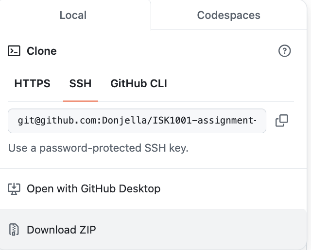

# Childcare Management Application
## Important links

* [Presentation Video](https://youtube.com)
* [GitHub Repository - for ISK1001 Assessment 03 ](https://github.com/Donjella/ISK1001-assignment-3)
## Table of Contents

1. [Important Links](#important-links)
2. [Overview and Purpose of the Application](#overview-and-purpose-of-the-application)
3. [Problem the Project Addresses, Target Audience, and Information](#problem-the-project-addresses-target-audience-and-information)
   - [Challenges in the Childcare Industry](#challenges-in-the-childcare-industry)
   - [How the Application Addresses These Challenges](#how-the-application-addresses-these-challenges)
   - [User Stories and Real-World Use Cases](#user-stories-and-real-world-use-cases)
4. [Application Setup](#application-setup)
   - [Cloning the Repository](#cloning-the-repository)
   - [Dependencies and Third-Party Libraries](#dependencies-and-third-party-libraries)
   - [Setting Up the Environment](#setting-up-the-environment)
5. [Application Features](#application-features)
   - [Student Management Menu](#student-management-menu)
     - [Add Student](#add-student)
     - [Delete Student](#delete-student)
     - [List Students](#list-students)
     - [Display Parent/Guardian Details](#display-parentguardian-details)
   - [Kitchen Management Menu](#kitchen-management-menu)
     - [Add/Update Menu for the Day](#addupdate-menu-for-the-day)
     - [Delete Menu for the Day](#delete-menu-for-the-day)
     - [List Menu for the Week](#list-menu-for-the-week)
     - [List Students with Allergies](#list-students-with-allergies)
   - [Data Persistence](#data-persistence)
   - [Styled Outputs](#styled-outputs)
   - [Error Handling and Input Validation](#error-handling-and-input-validation)
6. [Using the Application and Its Features](#using-the-application-and-its-features)
   - [Running the Application](#running-the-application)
   - [Main Menu Options](#main-menu-options)
     - [Student Management Menu](#student-management-menu)
     - [Kitchen Management Menu](#kitchen-management-menu)
     - [Exit](#exit)
7. [Ethics and Standards](#ethics-and-standards)
   - [Ethical Issues Addressed by the Application](#ethical-issues-addressed-by-the-application)
   - [Future Implementations to Consider](#future-implementations-to-consider)
8. [Third-Party Software Licensing and Security](#third-party-software-licensing-and-security)
   - [Overview of Third-Party Libraries Used](#overview-of-third-party-libraries-used)
   - [Licensing Compatibility](#licensing-compatibility)
   - [Security Impact Overview](#security-impact-overview)

## Overview and purpose of the application
This childcare management terminal application is designed to streamline and simplify the organization of classrooms, student records, caregiver details, and kitchen operations, with a default capacity of 100 students. By automating key administrative tasks, it enables efficient and accurate management of childcare centre operations.  

The application allows users to enrol students and automatically assign them to age-appropriate classrooms, reducing the manual effort of sorting and organizing students based on their age. It also enables the addition, viewing, and deletion of student records, including detailed information about parents or guardians, ensuring that all essential information is easily accessible and up to date.
Kitchen operations are efficiently managed with features to plan and update breakfast, lunch, and afternoon tea menus for 52 weeks of the year. The application prioritizes safety by tracking and displaying student allergies, helping staff cater to individual dietary needs and ensuring a secure environment for children.  

The overarching goal of this application is to automate repetitive administrative tasks, saving time and reducing the likelihood of human error. It provides a structured system for managing classrooms, student records, and menus, while enhancing safety through allergy tracking. By minimizing the burden of manual record-keeping, the application allows staff to focus more on delivering high-quality care and creating a nurturing environment for the children.

### Problem the project addresses, target audience and information 

The target market for this childcare management terminal application is childcare operators and providers, with the aim of helping them streamline their operations and enhance the quality of care they provide. By addressing key challenges in the childcare industry, the application is designed to support these users in overcoming common operational difficulties.  

According to [MyKidReports](https://mykidreports.com/blog/childcare-issues-which-are-faced-by-childcare-owners), a competing childcare management application addressing similar problems, one of the primary challenges faced by childcare providers, as highlighted in their list of 20 common issues, is managing multiple administrative tasks. These tasks are often time-consuming and error-prone, serving as the root cause of many other operational challenges and diverting focus from the goal of delivering secure, high-quality care and education.  

Among the listed challenges, maintaining safety and a healthy environment is frequently emphasized, particularly in relation to meeting licensing standards and earning the trust of clients—children and their families. To address this problem, our childcare management terminal application includes features to handle food allergies and dietary restrictions. It captures this critical information during the student enrolment process through the "add student" feature. Moreover, in the kitchen management menu, it displays a list of students with allergies to facilitate meal planning and accommodate dietary needs and restrictions.  

Additionally, childcare centres must efficiently manage administrative tasks and maintain thorough records to meet industry inspections, audits, and safety protocols. By incorporating persistent data storage, the childcare management terminal application ensures that student records, including allergy information and dietary plans, are automated and easily accessible—unless explicitly deleted. This functionality streamlines compliance efforts and enhances the overall operational efficiency of childcare centres.  

To complement the target market information outlined above and further demonstrate how the childcare management application addresses real-world challenges, real-life user stories from a popular industry forum and expectations deriving from the Australian Children's Education and Care Quality Authority (ACECQA) are highlighted below:

> “To design a menu for childcare is practically not an easy job where we have to consider a lot of factors and of course, various dietary requirements, allergies and many more” - [Aussie Childcare network](https://aussiechildcarenetwork.com.au/forum/supporting-educators/childcare-cooks-11179) forum member - y-neha

> “I am working under enormous pressure. There are so many children with special needs, dietary requirements and allergies - children are very vulnerable - and it is a huge responsibility that the cooks ensure that these needs are met. The number one priority of a child-care cook is to provide the children with a safe environment ensuring that their health and dietary needs are fulfilled” - [Aussie Childcare network](https://aussiechildcarenetwork.com.au/forum/supporting-educators/childcare-cooks-11179) forum member - backpack

The issue is addressed by the application through multiple features designed to simplify the management of dietary requirements and allergies. The "Add Student" function captures comprehensive information about each student's dietary needs and allergies during enrolment. This feature includes a validation process to ensure the data entered is accurate and complete, reducing the risk of oversight.  

Additionally, the application provides a "List of Student Allergies" feature that compiles and displays all recorded allergies in a structured and easily accessible format. This allows staff and kitchen teams to reference the information efficiently, ensuring no critical dietary requirement is overlooked.  

To further support childcare cooks and administrators, the application includes a menu planning feature that simplifies meal preparation for up to a year (52 weeks). Users can easily plan and update breakfast, lunch, and afternoon tea for each day, accommodating special dietary needs while maintaining variety and ensuring compliance with nutritional standards—all at a glance. These tools work seamlessly to reduce staff workload and create a safe, well-organized system for managing dietary requirements in a childcare environment.  

> According to [ACECQA](https://www.acecqa.gov.au/sites/default/files/2018-11/EnrolmentandOrientation.pdf#:~:text=Enrolment%20and%20orientation%2C%20when%20conducted,%2C%20expectations%2C%20and%20the%20coordinators.), “As a childcare provider, I want the enrolment process to reflect the program's expectations and services while fostering strong relationships with families.”  

This issue is mitigated through the "Add Student" feature, which collects vital information during the enrolment process. The feature prompts for dietary needs, ensuring that allergies and restrictions are accurately recorded to support safe meal planning. Birthdates are entered and used to automatically allocate students to age-appropriate classrooms, ensuring that they are placed in the correct programs. Additionally, parent or guardian contact information is collected, making it easy to nurture relationships with families through effective communication.  

By streamlining the enrolment process, this feature not only addresses administrative efficiency but also builds trust and collaboration with families by demonstrating the childcare centres’ commitment to safety, organization, and transparency. It ensures that families feel confident in the program and supported throughout their child's experience.

## Application Setup
Users can clone or fork the code of the application from its [GitHub repository](https://github.com/Donjella/assignment-2-CSA).

To clone this repository:

1. On this repository, above the list of files, click the green <> Code button  


2. Copy the URL for the repository. To clone the repository using an SSH key, including a certificate issued by your organization's SSH certificate authority, click SSH and copy the URL.  



3. Open Terminal.

4. Change the current working directory to the location where you want the cloned directory.

5. Type git clone, and then paste the URL you copied earlier 

    `git clone <SSH URL>`

6. Press ENTER to create your local clone.

More information about cloning a repository can be found [here](https://docs.github.com/en/repositories/creating-and-managing-repositories/cloning-a-repository).

-----

The application also uses both in-built and external libraries:

1. [Colored](https://pypi.org/project/colored/)
2. [PrettyTable](https://pypi.org/project/prettytable/)
3. [JSON](https://pypi.org/project/colored/)  
4. [Pytest](https://docs.pytest.org/en/latest/) 
5. [Pytest Mock](https://pytest-mock.readthedocs.io/en/latest/) 
6. [Python datetime module](https://docs.python.org/3/library/datetime.html) 
7. [Python Random Module](https://docs.python.org/3/library/random.html) 

More information on their licensing, security and compatibility impact can be viewed in the Third-party software licensing and security section.

### Setting Up the Environment
 ***Note*** :The application is developed and tested on Python 3.12.5 and is confirmed to work on Unix-like systems (specifically macOS). Compatibility on other operating systems is not guaranteed. Below are the instructions for setting up the environment on macOS; please adjust as needed for your system.

1. Install dependencies using a virtual environment.  

```bash
# to set up virtual environment
python3 -m venv .venv

# activate virtual environment
source .venv/bin/activate
```
2. Create a .gitignore file and add .venv to avoid pushing the virtual environment packages to the GitHub repository.
3. **requirements.txt** file is included in the application's [GitHub repository](https://github.com/Donjella/assignment-2-CSA). Hence, users can quickly install project dependencies once the virtual environment is active.  

```bash
# Ensure pip is installed and upgraded to the latest version
python -m pip install --upgrade pip

# Install dependencies from requirements.txt.
pip install -r requirements.txt

# ONLY if you wish to install dependencies manually. If you have installed from requirements.txt, you can ignore these:
pip install colored
pip install pytest
pip install pytest-mock
pip install prettytable
```

## Application Features

### Student Management Menu

- #### Add Student:  
Allows the entry of a student's name, birthdate, allergies, and parent/guardian details. Application automatically assigns student to their classroom based on their birthdate (age calculation)  

Babies Room (0-2 years)  
Toddlers Room (2-3 years)  
Kindergarten Room (3-5 years)
- #### Delete Student:  
 Remove a student from the system.
- #### List Students:   
Display students by their assigned classrooms based on age groups.

- #### Display Parent/Guardian Details:   
Retrieve and display the parent/guardian information associated with a specific student.

### Kitchen Management Menu

- #### Add/Update Menu for the Day: 
Input and update meals (breakfast, lunch, and afternoon tea) for specific days of the week.
    
- #### Delete Menu for the Day:
Remove the existing menu entries for a particular day.

- #### List Menu for the Week:   
View the meal plans for the entire week (Monday to Friday).

- #### List Students with Allergies:
Display all students who have recorded allergies, along with their classroom assignment and allergy details.

### Data Persistence
Save and Load Data: Automatically save students and kitchen data to JSON files (students.json and kitchen.json) for persistence across sessions.

### Styled Outputs
Using PrettyTable and Colored to produce neatly formatted outputs with color-coded messages and tables to enhance user experience.

### Error Handling and Input Validation
Robust error handling ensures that user input is validated at each step, enabling the application to gracefully handle various categories of errors, including Standard Errors, System-Related Errors, and User-Defined Errors. This comprehensive approach prevents incorrect data entry for critical details such as names, dates, allergies, and contact information, thereby enhancing the application's reliability and user experience.

## Using the application and its features
### Run the application

Navigate to the root directory of the project (where main.py is located).
```bash
# Start the application
python3 main.py
```
### Main Menu
Once application starts, you will be greeted with a welcome message, 2 management options to choose from (students or kitchen) and a third option to exit the application itself.

1. Students  
2. Kitchen
3. Exit


### Option 1 - Student Management Menu
Choosing option 1 will lead you to the Student Management Menu

1. Add Student 
2. Delete Student
3. List Students
4. Display Parent/Guardian Details
5. Save changes or/and return to the main menu


### Choice 1 - Add Student

You will be prompted one question at a time asking for the following input:

- Student's first name: 
- Student's last name:
- Student's birthday: *in YYYY-MM-DD format
- Does the student have any allergies?: *Yes or No answers
  - If yes, student will be prompted to enter what he/she is allergic to.
  - After entering allergy name, you will be prompted to enter if she has any more allergy.
  - If yes, prompt for allergy name again. If answer is no to allergy questions, you may proceed with parent/guardian details. 
- Enter guardian's first name:
- Enter guardian's last name:
- Enter guardian's contact number: 
- Enter guardian's email address:  


Upon successfully entering all details above, you will be greeted with a confirmation message in yellow with black background that student is assigned to his/her respective classroom based on his/her age.

### Choice 2 - Delete Student

You will be prompted to enter student ID of student to be deleted:

- Enter the student's student ID to delete:

Upon entering a valid (existing student ID associated with a student enrolled in a class), a confirmation of deletion of student will be printed.


### Choice 3 - List Students

3 separate tables for 3 individual classrooms will be printed, displaying students enrolled in their respective classrooms with the student's name, ID, and age shown in the table.


### Choice 4 - Display Parent/Guardian Details

You will be prompted to enter student ID to view the particular student's parent/guardian details:

- Enter the student's student ID to view his/her guardian details:

Upon entering a valid (existing student ID associated with a student enrolled in a class), his/her guardian details (name, contact number and email) will be printed.


### Choice 5 - Save changes and return to the main menu

### Important:
***To successfully save changes*** made to students (Addition or deletion of student) so that it will load the changes when you exit the student management menu or start the application again, ***you have to choose option 5 - save changes and return to the main menu***.  


Ensure you ***see the confirmation prompt in yellow and black*** that changes in the student menu is successfully saved to confirm you have exited the student management menu and changes are saved.

---

## Option 2 - Kitchen Management Menu
Choosing option 2 will lead you to the kitchen Management Menu

1. Add/Update menu for the day
2. Delete menu for the Day
3. List menu for the Week
4. List students with allergies
5. Save changes or/and return to the main menu


### Choice 1 - Add/Update menu for the day

You will be prompted one question at a time asking for the following input:

- Enter week number: Enter a number (inclusive of) between 1 to 52 to indicate which week of the year to add menu to.
- Enter the day of the week: Enter number only. i.e. (1 = Monday, 2 = Tuesday...5 = Friday)
Once successful, you will be prompted for:
- Enter name of breakfast dish:
- Enter name of lunch dish:
- Enter name of afternoon tea dish:   


Upon successfully entering the information above, you will receive a confirmation stating menu for selected day in selected week is updated.

### Choice 2 - Delete menu for the day

You will be prompted one question at a time asking for the following input:

- Enter week number: Enter a number (inclusive of) between 1 to 52 to indicate which week of the year to delete menu from. 
- Enter the day of the week to delete menu from: Enter number only. i.e. (1 = Monday, 2 = Tuesday...5 = Friday)


Upon successfully entering the information above, you will receive a confirmation stating that the menu for selected day in selected week has been deleted.

### Choice 3 - List menu for the week
      
You will be prompted one question at a time asking for the following input:

- Enter week number: Enter a number (inclusive of) between 1 to 52 to indicate which week of the year to list menu


Upon successfully entering the information above, you will be shown the menu (Breakfast, Lunch and Afternoon Tea) for each day of the week.

### Choice 4 - List student with allergies
      
A list of students with allergies will be printed in a table. The list is sorted by the student's classrooms, i.e. students are grouped together by their classrooms.


### Choice 5 - Save changes and return to the main menu**

### Important:
***To successfully save changes*** made to the kitchen menu (add/update/delete) so that it will load the changes when you exit the kitchen management menu or start the application again, ***you have to choose option 5 - save changes and return to the main menu***.  


Ensure you ***see the confirmation prompt in yellow and black*** that changes in the kitchen menu is successfully saved to confirm you have exited the kitchen management menu and changes are saved.

---

## Option 3 - Exit

Choosing option 3 in the main menu will exit the application itself.


Upon exiting the application, you will receive a thank you and see you again soon message.

## Ethics and standards - issues, how they are addressed and future improvements

With the childcare management terminal application handling sensitive data and protecting these data and information is vital. As such, robust privacy practices are essential throughout the software development process to prevent data exposure or exploitation.  

Handling student and parent/guardian information is generally considered sensitive*, especially when it includes:  

Personal Identifiable Information: This includes student names, ages, birthdays, and parent/guardian contact details (phone numbers and email addresses).  

Health Information: Information such as allergies or medical conditions, which is also considered sensitive data under many privacy laws.  

*[Privacy law in Australia](https://hallandwilcox.com.au/news/overview-of-privacy-law-in-australia/) - ‘Sensitive information’ is defined under the Privacy Act and includes information about an individual’s racial or ethnic origin, political opinions, professional or political or religious affiliations or memberships, sexual orientation or practices, criminal record, health, genetics and/or biometrics. Furthermore. Individual states also contain their legislation on how health information is handled. For example, the [Health Records Act 2001](https://www.health.vic.gov.au/legislation/health-records-act) in Victoria underscores the importance of securely managing health-related information, such as allergies, to safeguard individual rights and well-being. Additionally, [Article 16](https://www.ohchr.org/en/instruments-mechanisms/instruments/convention-rights-child) of the United Nations Convention on the Rights of the Child (UNCRC) recognizes the child’s right to privacy, making it critical to implement robust protections for student data in any childcare management system.  

Given these details, even though the application is a command-line interface and does not interact with external systems, proper care should be taken to ensure that the information stored securely:  

*	Make sure JSON files or any storage mechanisms are not accessible to unauthorized users.
*	Minimized Access: Access to this sensitive data should be limited to authorized individuals who need it for legitimate purposes.
*	No Unauthorized Sharing: Ensure the data is not accidentally shared, published, or exposed outside the application environment.
*	Data Protection Considerations: Properly handle user inputs to avoid any unintended processing, ensure no data leaks, and avoid unnecessary data retention.  

These ethical considerations are addressed in the application in the following ways:  

1.	Data privacy and security is addressed by the terminal application through storing data persistently in JSON files and sensitive information like student allergies and guardian contact details are only accessed when necessary.   

2.	In the ‘add student’ feature, the function and its codes does not discriminate, as classroom allocation is determined solely by birthdate. This ensures a fair and objective classroom placement based on predefined age ranges without favouring certain demographics or discriminating against others. Names, allergies, and other attributes are also collected without bias or assumptions about cultural or family backgrounds.  

3.	Error handling and validation: Input validation ensures data entered into the system is complete and correct, reducing the risk of inaccuracies or corrupted records. To illustrate, validating birthdates to ensure correct classroom allocation and allergy input process that prevents empty or invalid entries such as nonsensical data (special characters and numbers) with both allowing users to exit gracefully if they cannot or choose not to complete the input. This reduces the risk of incorrect allergy information or classroom allocations that could potentially endanger the safety or well-being of children.  

### Future implementations to consider regarding ethical issues

While the application currently handles this data safely as an internal use case (for a school project/assignment), additional measures should be considered if it is ever scaled to include a wider scope or becomes part of a web-based or distributed system.  

For instance, although the application ensures data is stored securely in a structured and organized way, it does not explicitly request consent for data storage, implementing a consent step (a prompt asking permission to save data) would strengthen compliance with ethical data protection standards. Asking for consent would also align with [General Data Protection Regulation (GDPR)](https://gdpr.eu/what-is-gdpr/), a global benchmark for data privacy that emphasizes obtaining explicit consent for data collection, allowing individuals to access or delete their data, and ensuring secure storage. If the application were to scale for international use, compliance with GDPR would be essential.   

Lastly, though not exhaustively, future improvements could include an administrator login for accessing student management functions, enabling security-focused testing. This would facilitate protections against unauthorized access, data handling and exposure risks with proper encryption protocols. Additionally, regular monitoring and bias checks throughout development would support ethical transparency and accountability. Fostering an ethical developmental and testing process requires ongoing vigilance and a commitment to continuous improvement. Hence, we will continue to anticipate and address emerging ethical concerns to ensure high quality and responsible software development.

### Third-party software licensing and security
The application makes use of various third-party software to facilitate its functionality and enhance user experience. 

Below is a comprehensive list of the third-party libraries used, their purposes, licenses, and information on their security and ethical impact.

1. ### [Colored](https://pypi.org/project/colored/)  
  
  - **Purpose**: to add color and styles to output in the application.
  - **Licence**: MIT Licence
  - **Ethical, legal and security impacts**: The library handles terminal output only and does not interact with sensitive data or external systems, ensuring minimal security risk.

2. ### [PrettyTable](https://pypi.org/project/prettytable/)
  
  - **Purpose**: PrettyTable is used within the application to create clean, well-formatted tables in this CLI app to display kitchen and student-related information.
  - **Licence**: BSD Licence
  - **Ethical, legal and security impacts**: PrettyTable is a pure table formatting library that poses no security risk as it doesn't process external inputs or handle sensitive data.

3. ### [JSON](https://pypi.org/project/colored/)  
  
  - **Purpose**: For reading from and writing to JSON files for student and kitchen data persistence.
  - **Licence**: Python Software Foundation Licence
  - **Ethical, legal and security impacts**: JSON is a built-in Python module and is secure for handling data serialization as long as it does not process untrusted input without proper validation.

4. ### [Pytest](https://docs.pytest.org/en/latest/) 
  
  - **Purpose**: Python testing framework for running unit tests to ensure code quality.
  - **Licence**: Python Software Foundation Licence
  - **Ethical, legal and security impacts**: Pytest is a testing framework used during development and testing phases only. It does not run in production and does not introduce any runtime security vulnerabilities.

5. ### [Pytest Mock](https://pytest-mock.readthedocs.io/en/)
  
  - **Purpose**: A plugin for pytest that provides easy mocking functionality to enable isolatation to parts of the application and test components effectively.
  - **Licence**: Python Software Foundation Licence
  - **Ethical, legal and security impacts**: Similar to pytest, it has no security impact on the production environment as it is used solely for development and testing.

6. ### [Python datetime module](https://docs.python.org/3/library/datetime.html) 

  - **Purpose**: A built-in Python module for handling dates and times, crucial for student age calculations and its related functionalities within the application.
  - **Licence**: Python Software Foundation Licence
  - **Ethical, legal and security impacts**: datetime is a secure module for handling date and time operations and does not introduce any security vulnerabilities.

7. ###  [Python Random Module](https://docs.python.org/3/library/random.html) 

  - **Purpose**: - A built-in Python module used to generate random unique student IDs for students in the application.
  - **Licence**: Python Software Foundation Licence
  - **Ethical, legal and security impacts**: The random module is suitable for generating unique IDs within the scope of this application. However, it is not intended for cryptographic purposes or secure applications beyond this context. For example, generating Secure Keys, Tokens or password hashing require high levels of randomness and unpredictability that go beyond what general-purpose modules like random can provide, typically to use in specialized cryptographic libraries.

### License Compatibility
All third-party libraries used are under permissive licenses such as MIT, BSD, and Python Software Foundation License. These licenses are compatible with each other and permit usage, modification, and distribution of the code without conflict. This ensures the application adheres to open-source principles without any licensing issues.

### Security Impact Overview
All third-party software used in this application has been chosen for their reliability and security. Most of the libraries either handle formatting (like colored, PrettyTable) or are used in a development/testing context (pytest, pytest-mock). The Python built-in libraries (datetime, random, json) are secure when used appropriately and do not introduce any security vulnerabilities into the application when handling trusted data.

